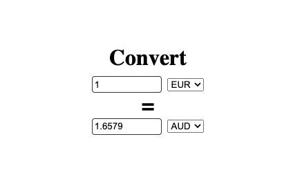

## React application for Currency Convertion.

## Functionalities:

-   Makes use of fetch API to fetch current convertion rate from open source api end point
-   User can update currency and amount
-   Displays the exchange rate for user enter amount
-   Hooks used
    -   useState
    -   useEffect
